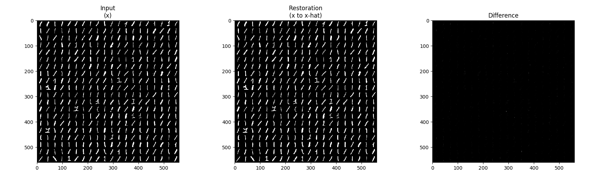

[PyTorch] GANomaly
=====

Implementation of GANomaly-GradCon Hybrid with MNIST dataset. This is really an amalgation of two different models: GANomaly and GradCon.

Currently, there is a problem with the amount of RAM needed to run the code. Better code or bigger computer is needed.

## Architecture

    
  
Simplified GANomaly architecture.

## Graph in TensorBoard

    
  
Graph of GANomaly.

##How to run

  Step 1: Use a new fresh anaconda environment
  Step 2: Install all packages in requirements.txt
  Step 3: run "python run.py" in the folder

## Problem Definition

    
  
'Class-1' is defined as normal and the others are defined as abnormal.

## Results

    
  
Restoration result by GANomaly.

  
  
Box plot with encoding loss of test procedure.

## Environment
* Python 3.7.4  
* PyTorch 1.1.0  
* Numpy 1.17.1  
* Matplotlib 3.1.1  
* Scikit Learn (sklearn) 0.21.3  
* Psutil 5.7.2

## Reference
[1] S Akcay, et al. (2018). <a href="https://arxiv.org/abs/1805.06725">Ganomaly: Semi-supervised anomaly detection via adversarial training.</a>. arXiv preprint arXiv:1805.06725.
[2] @inproceedings{kwon2020backpropagated,
  title={Backpropagated Gradient Representations for Anomaly Detection},
  author={Kwon, Gukyeong and Prabhushankar, Mohit and Temel, Dogancan and AlRegib, Ghassan},
  booktitle={Proceedings of the European Conference on Computer Vision (ECCV)},
  year={2020}
}