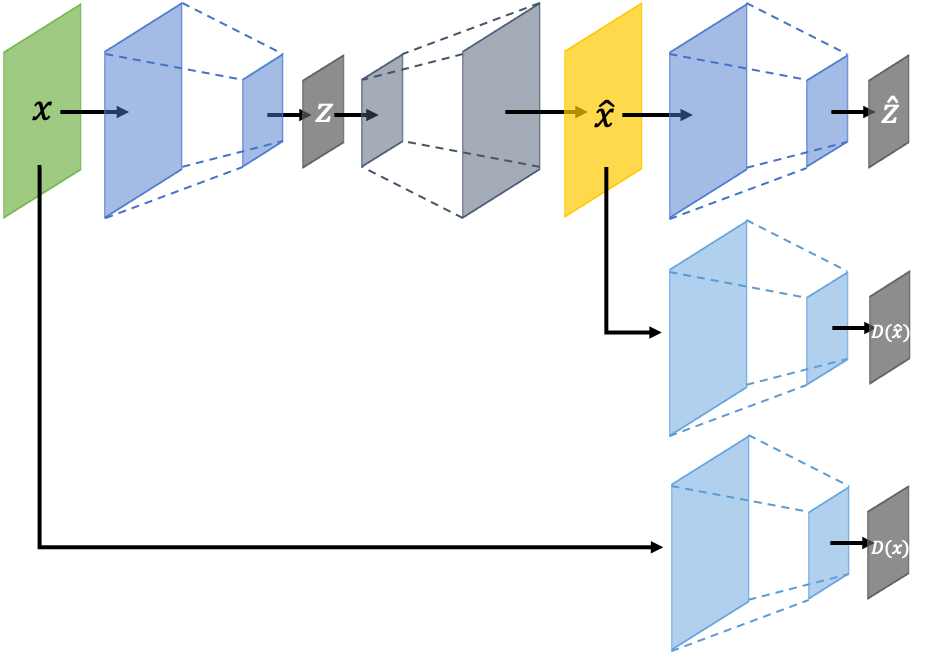
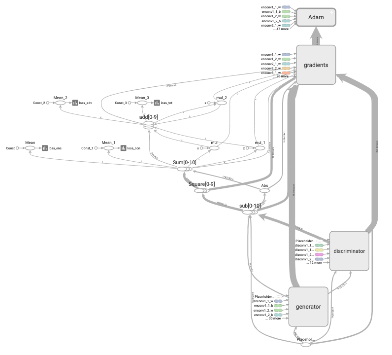
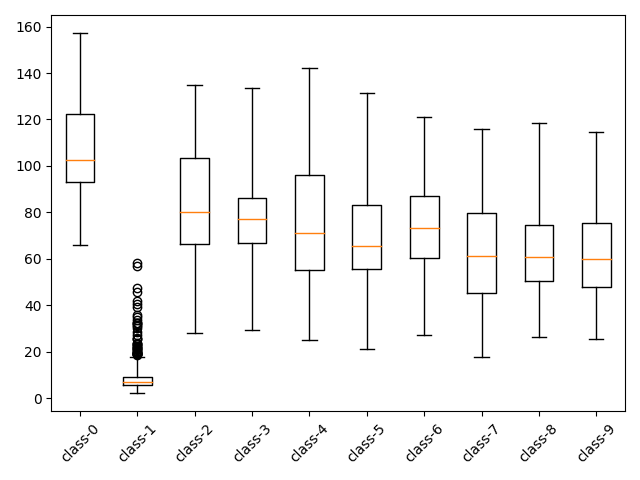

[PyTorch] GAN-Grad
=====

Implementation of GANomaly-GradCon Hybrid with MNIST dataset. This is really an amalgation of two different models: GANomaly and GradCon.

Currently, there is a problem with the amount of RAM needed to run the code. Better code or bigger computer is needed.

## Architecture
<div align="center">
    
  <p>Simplified GANomaly architecture.</p>
</div>

## Graph in TensorBoard
<div align="center">
    
  <p>Graph of GANomaly.</p>
</div>

##How to run
<div align="center">
Clone this repository and run following commands to create a conda environment and install all dependencies.
```
	conda create -n GAN-Grad python=3.6
	conda activate GAN-Grad
	cd Anomaly-Detection
	conda install pytorch torchvision -c pytorch
	pip install -r requirments.txt
```
</div>

## Problem Definition
<div align="center">
    
  <p>'Class-1' is defined as normal and the others are defined as abnormal.</p>
</div>

##Method 
<div align="center">
	One may freely choose the split in the training/validation/test phases of the program. 
	Train:
	
	Validation:
	
	Test:
</div>

## Results
<div align="center">
	The results generated by this program is:
	<ul>
	<li>PCA plot of the latent space in the Autoencoder part</li>
	<li>Histograms for every term in the objective function, for normal and abnormal data</li>
	<li>Clustering of the L_grad, and associated classes.</li>
	</ul>
</div>

<div align="center">
  
  <p>Box plot with encoding loss of test procedure.</p>
</div>

## Environment
* Python 3.7.4  
* PyTorch 1.1.0  
* Numpy 1.17.1  
* Matplotlib 3.1.1  
* Scikit Learn (sklearn) 0.21.3  
* Psutil 5.7.2

## Reference
[1] S Akcay, et al. (2018). <a href="https://arxiv.org/abs/1805.06725">Ganomaly: Semi-supervised anomaly detection via adversarial training.</a>. arXiv preprint arXiv:1805.06725.
[2] @inproceedings{kwon2020backpropagated,
  title={Backpropagated Gradient Representations for Anomaly Detection},
  author={Kwon, Gukyeong and Prabhushankar, Mohit and Temel, Dogancan and AlRegib, Ghassan},
  booktitle={Proceedings of the European Conference on Computer Vision (ECCV)},
  year={2020}
}